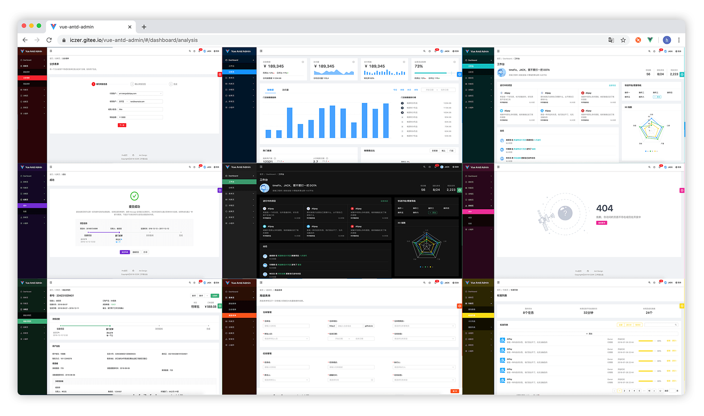

简体中文 
<h1 align="center">Scd client web</h1>

<div align="center">
  
投审稿系统客户端 的 Web 端  


</div>

- 预览地址：http://localhost:30610
- 使用文档：[文档](./docs/start/use.md)

## 浏览器支持
现代浏览器及 IE11

| [](http://godban.github.io/browsers-support-badges/)</br>IE / Edge | [](http://godban.github.io/browsers-support-badges/)</br>Firefox | [](http://godban.github.io/browsers-support-badges/)</br>Chrome | [](http://godban.github.io/browsers-support-badges/)</br>Safari | [](http://godban.github.io/browsers-support-badges/)</br>Opera |
| --- | --- | --- | --- | --- |
| IE11, Edge | last 2 versions | last 2 versions | last 2 versions | last 2 versions |


### clone
```bash
$ git clone git@10.190.6.211:liuli/scd-client-web.git
```
### yarn
```bash
$ yarn install
$ yarn serve
```
### or npm
```
$ npm install
$ npm run serve
```
---
<div align="center">

多种主题模式可选：  

</div>

### 配置主题
```javascript
// 自定义配置，参考 ./default/setting.config.js，需要自定义的属性在这里配置即可
module.exports = {
  theme: {
    color: '#13c2c2',
    mode: 'dark',
  },
  multiPage: true,
  animate: {
    name: 'lightSpeed',
    direction: 'left'
  }
}
```
## 目录结构
我们已经为你生成了一个完整的开发框架，提供了涵盖中后台开发的各类功能和坑位，下面是整个项目的目录结构。

```bash
├── docs                     # 使用文档
├── public
│   └── favicon.png          # favicon
│   └── index.html           # 入口 HTML
├── src
│   ├── assets               # 本地静态资源
│   ├── components           # 内置通用组件
│   ├── config               # 系统配置
│   ├── layouts              # 通用布局
│   ├── mock                 # 本地 mock 数据
│   ├── pages                # 页面组件和通用模板
│   ├── plugins              # vue 插件
│   ├── router               # 路由配置
│   ├── services             # 数据服务模块
│   ├── store                # vuex 状态管理配置
│   ├── theme                # 主题相关
│   ├── utils                # js 工具
│   ├── App.vue              # 应用入口组件
│   ├── bootstrap.js         # 应用启动引导js
│   └── main.js              # 应用入口js
├── package.json             # package.json
├── README.md                # README.md
└── vue.config.js            # vue 配置文件
```


# 异步路由和菜单
---
在现实业务中，存在这样的场景，系统的路由和菜单会根据用户的角色变化而变化，或者路由菜单根据用户的权限动态生成。我们为此准备了一套完整的异步加载方案，
可以让你很方便的从服务端加载路由和菜单配置，并应用到系统中。
## 异步加载路由
动态路由的实现主要有以下四个步骤：
### 开启异步路由设置
在 `/config/config.js` 文件中设置 `asyncRoutes` 的值为 true:
```js {7}
module.exports = {
  theme: {
    color: '#13c2c2',
    mode: 'night'
  },
  multiPage: true,
  asyncRoutes: true,       //异步加载路由，true:开启，false:不开启
  animate: {
    name: 'roll',
    direction: 'default'
  }
}
```
### 注册路由组件
基础路由组件包含路由基本配置和对应的视图组件，我们统一在 `/router/async/router.map.js` 文件中注册它们。它和正常的路由配置基本无异，相当于把完整的路由拆分成单个的路由配置进行注册，为后面的路由动态配置打好基础。  
一个单独的路由组件注册示例如下：
```jsx
registerName: {                               //路由组件注册名称，唯一标识
  path: 'path',                               //路由path，可缺省，默认取路由注册名称 registerName 的值
  name: '演示页',                             //路由名称
  redirect: '/login',                         //路由重定向
  component: () => import('@/pages/demo'),    //路由视图
  icon: 'permission',                         //路由的菜单icon，会注入到路由元数据meta中
  invisible: false,                           //是否隐藏菜单项，true 隐藏，false 不隐藏，会注入到路由元数据meta中。
  authority: {                                //路由权限配置，会注入到路由元数据meta中。可缺省，默认为 ‘*’, 即无权限限制
    permission: 'form',                       //路由需要的权限  
    role: 'admin'                             //路由需要的角色。当permission未设置，通过 role 检查权限
  },                     
  page: {                                     //路由的页面数据，会注入到路由元数据meta中
    title: '演示页',                          //页面标题
    breadcrumb: ['首页', '演示页']            //页面面包屑
  }             
}
```

:::details 点击查看完整的路由注册示例：
```js
// 视图组件
const view = {
  tabs: () => import('@/layouts/tabs'),
  blank: () => import('@/layouts/BlankView'),
  page: () => import('@/layouts/PageView')
}

// 路由组件注册
const routerMap = {
  login: {
    authority: '*',
    path: '/login',
    component: () => import('@/pages/login')
  },
  demo: {
    name: '演示页',
    renderMenu: false,
    component: () => import('@/pages/demo')
  },
  exp403: {
    authority: '*',
    name: 'exp403',
    path: '403',
    component: () => import('@/pages/exception/403')
  },
  exp404: {
    name: 'exp404',
    path: '404',
    component: () => import('@/pages/exception/404')
  },
  exp500: {
    name: 'exp500',
    path: '500',
    component: () => import('@/pages/exception/500')
  },
  root: {
    path: '/',
    name: '首页',
    redirect: '/login',
    component: view.tabs
  },
  parent1: {
    name: '父级路由1',
    icon: 'dashboard',
    component: view.blank
  },
  parent2: {
    name: '父级路由2',
    icon: 'form',
    component: view.page
  },
  exception: {
    name: '异常页',
    icon: 'warning',
    component: view.blank
  }
}
export default routerMap
```
:::
### 配置基本路由
如果没有任何路由，你的应用是无法访问的，所以我们需要在本地配置一些基本的路由，比如登录页、404、403 等。你可以在 `/router/async/config.async.js` 文件中配置一些本地必要的路由。如下：
```js
const routesConfig = [
  'login',                      //匹配 router.map.js 中注册的 registerName = login 的路由
  'root',                       //匹配 router.map.js 中注册的 registerName = root 的路由
  {
    router: 'exp404',           //匹配 router.map.js 中注册的 registerName = exp404 的路由
    path: '*',                  //重写 exp404 路由的 path 属性
    name: '404'                 //重写 exp404 路由的 name 属性
  },
  {
    router: 'exp403',           //匹配 router.map.js 中注册的 registerName = exp403 的路由
    path: '/403',               //重写 exp403 路由的 path 属性
    name: '403'                 //重写 exp403 路由的 name 属性
  }
]
```
完成配置后，即可通过 `routesConfig` 和已注册的 `routerMap` 生成 [router.options.routes](https://router.vuejs.org/zh/api/#router-%E6%9E%84%E5%BB%BA%E9%80%89%E9%A1%B9) 配置，如下：
```js
const options = {
  routes: parseRoutes(routesConfig, routerMap)
}
```
:::details 点击查看完整的 config.async.js 代码
```js
import routerMap from './router.map'
import {parseRoutes} from '@/utils/routerUtil'

// 异步路由配置
const routesConfig = [
  'login',
  'root',
  {
    router: 'exp404',
    path: '*',
    name: '404'
  },
  {
    router: 'exp403',
    path: '/403',
    name: '403'
  }
]
const options = {
  routes: parseRoutes(routesConfig, routerMap)
}
export default options
```
:::
完成以上设置后，本地就已经有了包含 login、404、403 页面的路由，并且这些路由是可以直接访问的。
### 异步获取路由配置
当用户登录后（或者其它的前提条件），你可能想根据不同用户加载不同的路由和菜单。
那么我们就需要先从后端服务获取异步路由配置，后端返回的异步路由配置 `routesConfig` 是一个异步路由配置数组， 应当如下格式：
```jsx
[{
  router: 'root',                           //匹配 router.map.js 中注册名 registerName = root 的路由
  children: [                               //root 路由的子路由配置
    {
      router: 'dashboard',                  //匹配 router.map.js 中注册名 registerName = dashboard 的路由
      children: ['workplace', 'analysis'],  //dashboard 路由的子路由配置，依次匹配 registerName 为 workplace 和 analysis 的路由
    },
    {
      router: 'form',                       //匹配 router.map.js 中注册名 registerName = form 的路由
      children: [                           //form 路由的子路由配置
        'basicForm',                        //匹配 router.map.js 中注册名 registerName = basicForm 的路由
        'stepForm',                         //匹配 router.map.js 中注册名 registerName = stepForm 的路由
        {
          router: 'advanceForm',            //匹配 router.map.js 中注册名 registerName = advanceForm 的路由
          path: 'advance'                   //重写 advanceForm 路由的 path 属性
        }
      ]   
    },
    {
      router: 'basicForm',                  //匹配 router.map.js 中注册名 registerName = basicForm 的路由
      name: '验权表单',                     //重写 basicForm 路由的 name 属性
      icon: 'file-excel',                   //重写 basicForm 路由的 icon 属性
      authority: 'form'                     //重写 basicForm 路由的 authority 属性
    }
  ]
}]
```
其中 `router` 属性 对应 `router.map.js` 中已注册的`基础路由`的注册名称 `registerName`，`children` 属性为路由的嵌套子路由配置。  
有些情况下你可能想重写已注册路由的属性，你可以为 `routesConfig` 配置同名属性去覆盖它。如上面的`验权表单`路由覆盖了注册路由的 `name`、`icon`、`authority` 属性。

### 加载路由并应用
我们提供了一个路由加载工具，你只需调用 `/utils/routerUtil.js` 中的 `loadRoutes` 方法加载上一步获取到的 `routesConfig` 即可，如下：
```js {3}
getRoutesConfig().then(result => {
  const routesConfig = result.data.data
  loadRoutes({router: this.$router, store: this.$store, i18n: this.$i18n}, routesConfig)
})
```
至此，异步路由的加载就完成了，你可以访问异步加载的路由了。
:::tip
上面获取异步路由的代码，在 /pages/login/Login.vue 文件中可以找到。   
loadRoutes 方法会合并 /router/async/config.async.js 文件中配置的基本路由。
:::
:::details 点击查看 loadRoutes 的详细代码
```js
/**
 * 加载路由
 * @param router 应用路由实例
 * @param store 应用的 vuex.store 实例
 * @param i18n 应用的 vue-i18n 实例
 * @param routesConfig 路由配置
 */
function loadRoutes({router, store, i18n}, routesConfig) {
  // 如果 routesConfig 有值，则更新到本地，否则从本地获取
  if (routesConfig) {
    store.commit('account/setRoutesConfig', routesConfig)
  } else {
    routesConfig = store.getters['account/routesConfig']
  }
  // 如果开启了异步路由，则加载异步路由配置
  const asyncRoutes = store.state.setting.asyncRoutes
  if (asyncRoutes) {
    if (routesConfig && routesConfig.length > 0) {
      const routes = parseRoutes(routesConfig, routerMap)
      formatAuthority(routes)
      const finalRoutes = mergeRoutes(router.options.routes, routes)
      router.options = {...router.options, routes: finalRoutes}
      router.matcher = new Router({...router.options, routes:[]}).matcher
      router.addRoutes(finalRoutes)
    }
  }
  // 初始化Admin后台菜单数据
  const rootRoute = router.options.routes.find(item => item.path === '/')
  const menuRoutes = rootRoute && rootRoute.children
  if (menuRoutes) {
    mergeI18nFromRoutes(i18n, menuRoutes)
    store.commit('setting/setMenuData', menuRoutes)
  }
}
```
:::

## 异步加载菜单
Vue Antd Admin 的菜单，是根据路由配置自动生成的，默认获取根路由 `‘/’` 下所有子路由作为菜单配置。  
当你完成了异步路由的加载，菜单也会随之改变，无需你做其它额外的操作。主要代码如下：
```js
// 初始化Admin后台菜单数据
  const rootRoute = router.options.routes.find(item => item.path === '/')
  const menuRoutes = rootRoute && rootRoute.children
  if (menuRoutes) {
    mergeI18nFromRoutes(i18n, menuRoutes)
    store.commit('setting/setMenuData', menuRoutes)
  }
```
:::tip
如果你不想从根路由 `‘/’` 下获取菜单数据，可以根据自己的需求更改。
:::


# 权限管理
---
权限控制是中后台系统中常见的需求之一，你可以利用 Vue Antd Admin 提供的权限控制脚手架，实现一些基本的权限控制功能。
## 角色和权限
通常情况下有两种方式可以控制用户权限，一种是通过用户角色 role 来控制权限，另一种是通过更细致的权限 permission 来控制。
这两种方式 Vue Antd Admin 都支持。  
我们定义了 role 和 permission 的基本格式，如果你获取的 role 和 permission 数据格式与 Vue Antd Admin 不一致，
你需要在获取到 role 和 permission 后将其转换为 Vue Antd Admin 的格式。
### 角色
Vue Antd Admin 的 `角色/role` 包含 `id` 和 `operation` 两个属性。其中 `id` 为 `角色/role` 的 id，`operation` 为 `角色/role` 具有的操作权限，是一个字符串数组。
```js
role = {
  id: 'admin',                                   //角色ID
  operation: ['add', 'delete', 'edit', 'close']  //角色的操作权限
}
```
你也可以设置 role 的值为字符串，比如 role = 'admin', 它等同于：
```js
role = {
  id: 'admin'
}
```
### 权限
Vue Antd Admin 的 `权限/permission` 也包含 `id` 和 `operation` 两个属性。其中 `id` 为 `权限/permission` 的 id，`operation` 为 `权限/permission` 下的操作权限，是一个字符串数组。
```js
permission = {
  id: 'form',                                    //权限ID
  operation: ['add', 'delete', 'edit', 'close']  //权限下的操作权限
}
```
你也可以设置 role 的值为字符串，比如 permission = 'form', 它等同于：
```js
permission = {
  id: 'form'
}
```
### 设置用户的角色和权限
你只需为用户配置 roles 和 permissions 两者中的其中一种，即可完成权限管理功能。当然你也可以两者都配置。 
 
获取到用户权限或角色后，将其格式化转为 Vue Antd Admin 可用的格式，然后使用 `store.commit('account/setPermissions', permissions)` 或 `store.commit('account/setRoles', roles)`
将其存在本地即可。如下：
```js
getPermissions().then(res => {
  const permissions = res.data
  this.$store.commit('account/setPermissions', permissions)
})
getRoles().then(res => {
  const roles = res.data
  this.$store.commit('account/setRoles', roles)
})
```
:::tip
注意，存在本地的 permissions 和 roles 都应该是数组。  
你可以在 /pages/login/Login.vue 查看完整的用户角色和权限设置代码。
:::
## 页面权限
如果你想给一些页面设置准入权限，只需要给该页面对应的路由设置元数据 authority 即可。 authority 的值可以是一个字符串，也可以是对象。  

如下路由配置，则表明 `验权页面` 需要准入权限(permission): `form`
```js {5}
const route = {
  name: '验权页面',
  path: 'auth/demo',
  meta: {
    authority: 'form',
  },
  component: () => import('@/pages/demo')
}
```
下面是 authority 的值为对象的写法，这种写法和上面字符串的写法具有相同的效果：
```js {5-7}
const route = {
  name: '验权页面',
  path: 'auth/demo',
  meta: {
    authority: {
      permission: 'form'
    }
  },
  component: () => import('@/pages/demo')
}
```
有时你可能需要通过用户角色来配置页面权限，我们同样支持，用法和上面类似。  

如下配置，表明 `验权页面` 需要准入角色(role) `admin`：
```js {5-7}
const route = {
  name: '验权页面',
  path: 'auth/demo',
  meta: {
    authority: {
      role: 'admin'
    }
  },
  component: () => import('@/pages/demo')
}
```
:::tip
当你未设置 authority 或 设置 authority 的值 为 `*` 时，等同于该页面无需权限限制，我们会忽略此页面的权限检查。
:::
:::tip
当 authority 的值为字符串时，会以 [权限/permission](#权限) 验证权限。如果你需要以 [角色/role](#角色) 验证权限，请以对象形式设置 authority 的值。
:::
## 操作权限
在一些复杂的些场景下，权限可能不仅仅是页面层级这么简单。在一些页面你可能需要校验用户是否具有某些操作的权限，比如 增、删、改、查等。  
为此，我们提供了 `权限校验注入` 和 `权限校验指令` 两个实用的功能。
### 权限校验注入
通过对Vue组件的实例方法进行 `权限校验注入`，我们可以控制该实例方法的执行权限，从而精准且安全的验证用户操作。  

比如，QueryList 页面的 deleteRecord 方法，我们希望具有操作权限 `delete` 的用户才能调用此方法。
只需为 `deleteRecord` 方法注入权限校验，按如下方式配置 `authorize` 即可：
```vue {9-11,13}
<template>
  ...
</template>
<script>
...
export default {
  name: 'QueryList',
  data () {...},
  authorize: {              //权限校验注入设置
    deleteRecord: 'delete'  //key为需要注入权限校验的方法名，这里为 deleteRecord 方法；值为需要校验的操作权限，这里为 delete 操作权限
  },
  methods: {
    deleteRecord(key) {
      this.dataSource = this.dataSource.filter(item => item.key !== key)
      this.selectedRows = this.selectedRows.filter(item => item.key !== key)
    },
    ...
  }
}
</script>
```
如果用户没有 `delete` 权限，调用 deleteRecord 方法，会看到如下提示：  


### 操作权限校验的类型
`authorize` 会根据当前页面匹配到的权限类型([permission](#权限) / [role](#角色))，来判断是使用 `permission.operation` 还是 `role.operation` 来进行权限校验。
如果当前页面同时匹配到了 permission 和 role 权限，则默认通过 permission.operation 来进行操作权限校验。  

当然你也可以指定操作权限校验的类型，如下设置即可：
```js {2-5}
authorize: {             
  deleteRecord: {        //需要 注入权限校验 的方法名：deleteRecord
    check: 'delete',     //需要校验的操作权限：check
    type: 'role'         //指定操作权限校验的类型，可选 permission 和 role。这里指定以 role.operation 校验操作权限
  }
}
```
### 权限校验指令
有时我们可能希望用户能够更直观的了解自己的操作权限。比如给没有操作权限的控件应用 disable 样式，禁用 click 事件等。
我们提供了权限校验指令 `v-auth` 来实现这个功能。  

比如，我们想为 QueryList 页面的删除控件进行 `delete` 操作权限校验，只需为删除控件设置 v-auth="\`delete\`" 指令即可，如下：
```vue {6}
<template>
  <a-card>...
    <standard-table ...>
      ...
      <div slot="action" slot-scope="{text, record}">
        <a @click="deleteRecord(record.key)" v-auth="`delete`">
          <a-icon type="delete" />删除
        </a>
      </div>
      ...
    </standard-table>
  </a-card>
</template>
```
假如用户没有 `delete` 操作权限，则控件会被应用 disable 样式，且 click 事件无效，如下图：  


:::warning 重要！！！
v-auth 是我们自定义的一个 [Vue指令](https://cn.vuejs.org/v2/guide/custom-directive.html#ad)。因为 `Vue指令` 的值需要是一个 javascript 表达式，因此你不能直接给 v-auth 赋值为字符串，
需要把 v-auth 的字符串值用 ` `` ` 包裹起来，否则可能会报 undefined 错误。
:::
### 权限校验指令的类型
你同样也可以指定 v-auth 的权限校验类型，可选 [permission](#权限) 和 [role](#角色)。它的校验方式和 [authorize](#权限校验注入) 类似，如未指定则会自动识别。
`v-auth:role` 表示通过 `role.operation` 进行校验，`v-auth:permission` 表示通过 `permission.operation` 进行校验。 
 
如下，指定通过 `role.operation` 校验删除控件的操作权限：
```vue {3}
<div slot="action" slot-scope="{text, record}">
  ...
  <a v-auth:role="`delete`">
    <a-icon type="delete" />删除
  </a>
  ...
</div>
```
## 异步路由权限
异步路由同样可以进行权限校验配置，它和正常的路由权限配置基本无异，只是无需把 [authority](#页面权限) 配置在元数据属性 meta 里。
你可以在路由组件注册时设置 authority，也可以在异步路由配置里设置 authority。  

路由组件注册时设置 [authority](#页面权限)：
```js {6}
// 路由组件注册
const routerMap = {
  ...
  demo: {
    name: '演示页',
    authority: 'form',
    component: () => import('@/pages/demo')
  }
  ...
}
```

异步路由配置里设置 [authority](#页面权限)：
```js {11-13}
const routesConfig = [{
    router: 'root',
    children: ['demo',
      {router: 'parent1'...},
      ...
      {
        router: 'demo',
        icon: 'file-ppt',
        path: 'auth/demo',
        name: '验权页面',
        authority: {
          permission: 'form',
        }
      }
    ]
  }]
```
